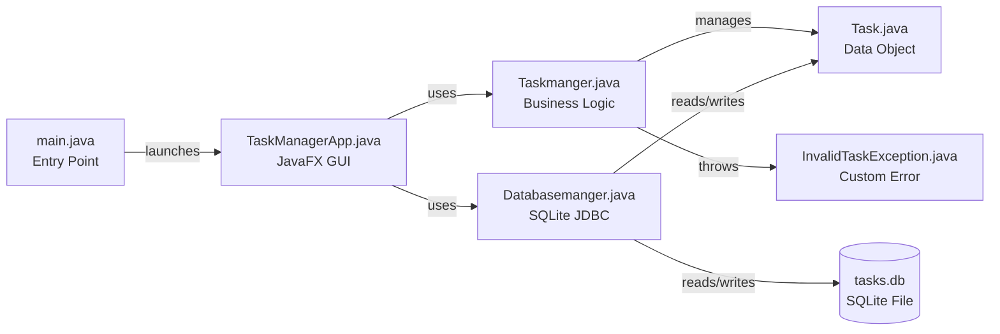
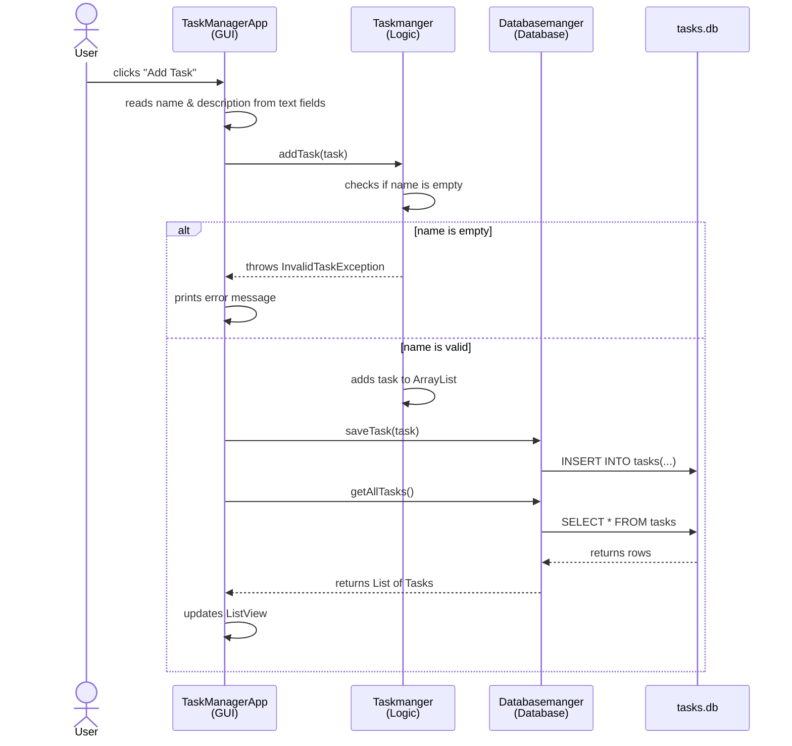
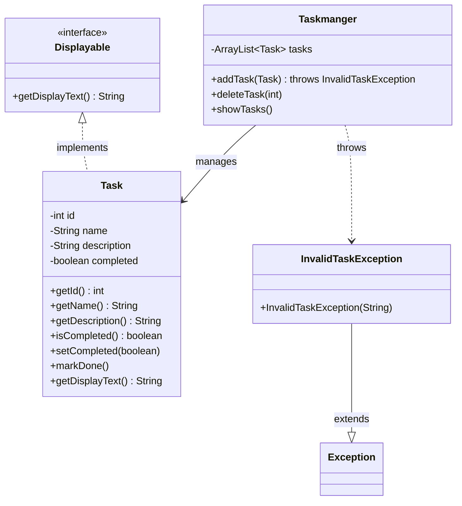

# Task Manager — Guide for Ahmed

## Part 1: How the App Works Right Now

You have 6 Java files. Here's what each one does and how they connect:



In plain English: `main` launches the GUI window. The GUI talks to `Taskmanger` for logic and `Databasemanger` for saving/loading. Both of them work with `Task` objects.

### File-by-file breakdown

**`main.java`** — The entry point. One line: it launches the JavaFX app. That's it.

**`Task.java`** — A plain data class. It holds 4 things about a task: `id`, `name`, `description`, `completed`. It has getters, setters, and a constructor. Think of it as a container for one task's data.

**`InvalidTaskException.java`** — A custom exception. When someone tries to add a task with an empty name, this gets thrown. Why custom? Because the professor wants to see that you can create your own exception types, not just use Java's built-in ones.

**`Taskmanger.java`** — The business logic layer. It holds an `ArrayList<Task>` in memory and has 3 methods:
- `addTask(t)` — checks if the task name is valid, throws `InvalidTaskException` if not, otherwise adds it to the list
- `deleteTask(id)` — removes a task by ID
- `showTasks()` — prints all tasks to the console

Why have this AND a database class? Separation of concerns — the GUI doesn't talk to the database directly. It goes through the manager. This is what the professor means by "clear class responsibilities."

**`Databasemanger.java`** — The database layer. Uses JDBC (Java Database Connectivity) to talk to a SQLite file called `tasks.db`. It has:
- `createTable()` — runs when the app starts, creates the `tasks` table if it doesn't exist yet
- `saveTask(t)` — inserts a task into the database
- `getAllTasks()` — reads all tasks from the database and returns them as a `List<Task>`
- `deleteTask(id)` — deletes a task by ID

The `try-with-resources` pattern (the `try (Connection conn = ...)` syntax) automatically closes the database connection when done. This is "proper resource handling" — the professor will look for this.

**`TaskManagerApp.java`** — The GUI. This is where everything comes together. Read Part 2 below to understand how it works.

---

## Part 2: JavaFX in 5 Minutes

JavaFX is Java's GUI framework. Here are the only concepts you need:

### The 3 layers: Stage, Scene, Controls

```
Stage  =  the window itself (the frame with the X button)
Scene  =  the content inside the window
Controls  =  the actual stuff: buttons, text fields, lists
```

Your app's `start(Stage stage)` method receives the window (Stage). You build the content (Scene) and put it in the window.

### Layout containers

You don't place things by pixel coordinates. Instead, you use layout containers:

- **`VBox`** — stacks things vertically (top to bottom)
- **`HBox`** — stacks things horizontally (left to right)

In our app: the top row (text fields + buttons) is an `HBox`. The whole thing (top row + list) is a `VBox`.

```
VBox (vertical stack)
 |
 |-- HBox (horizontal row)
 |    |-- TextField (task name)
 |    |-- TextField (description)
 |    |-- Button (Add)
 |    |-- Button (Delete)
 |
 |-- ListView (shows all tasks)
```

### Event handlers

When a user clicks a button, you want something to happen. That's an event handler:

```java
button.setOnAction(e -> {
    // this code runs when the button is clicked
});
```

The `e ->` is a lambda (shorthand for an anonymous function). The code inside `{ }` is what happens on click.

In our app, the Add button's handler: reads the text fields, creates a Task, saves it to the DB, and refreshes the list.

### What happens when you click "Add Task"

This is the full flow — from click to saved in the database:



This diagram is also useful for the oral discussion — it shows you understand the full flow, not just individual files.

### The lifecycle

1. `main.java` calls `Application.launch(TaskManagerApp.class)`
2. JavaFX creates a `TaskManagerApp` object and calls its `start()` method
3. Inside `start()`, you build the UI and call `stage.show()` to display the window
4. From here, the app just waits for user actions (clicks, typing, etc.)

That's it. That's all the JavaFX you need to know.

---

## Part 3: What You Still Need to Do

Here's your checklist. Each item explains what to do, where to do it, and why the professor cares.

---

### 1. Encapsulation in Task.java

**What:** Make all 4 fields in `Task.java` `private`.

**Where:** `Task.java`, lines 12-15.

**Why:** Right now the fields are "package-private" (no access modifier). That means any class in the same package can directly read/write them like `task.name = "whatever"`. Encapsulation means hiding the internal data and forcing other classes to use getters/setters. This is OOP 101 — the professor WILL check for this.

**How:** Change:
```java
String name;
boolean completed;
int id;
String description;
```
to:
```java
private String name;
private boolean completed;
private int id;
private String description;
```

The getters and setters already exist, so nothing else breaks. But now go through `Taskmanger.java` — it accesses `t.name` and `t.id` directly in a few places. Change those to use `t.getName()` and `t.getId()` instead.

---

### 2. Add an Interface (Inheritance/Polymorphism)

**What:** Create a `Displayable` interface and have `Task` implement it.

**Where:** New file `Displayable.java` in the same package, then edit `Task.java`.

**Why:** The project requires "inheritance or interfaces" and "polymorphism." An interface is a contract — it says "any class that implements me must have these methods." Polymorphism means you can treat different types through the same interface. The professor wants to see that you understand these concepts, not just use basic classes.

Here's what the class structure should look like after you're done:



Notice: the `-` means private, `+` means public. The dashed arrow with "implements" is the interface relationship.

**How — Step 1:** Create `Displayable.java`:
```java
package com.mycompany.thproject;

public interface Displayable {
    String getDisplayText();
}
```

**How — Step 2:** Make Task implement it. Add `implements Displayable` to the class declaration, then add the method:
```java
public class Task implements Displayable {
    // ... existing code ...

    @Override
    public String getDisplayText() {
        return id + " - " + name + " - " + description;
    }
}
```

**How — Step 3:** Now use it. In `TaskManagerApp.java`, the `refreshList()` method currently builds the display string manually. Change it to call `t.getDisplayText()` instead. This is polymorphism in action — you're calling a method through the `Displayable` interface, and the `Task` class provides the implementation.

**Bonus understanding:** If you later had a different class (say `Meeting`) that also implements `Displayable`, you could display both Tasks and Meetings in the same list without changing the list code. That's the power of polymorphism.

---

### 3. Add a Background Task (Concurrency)

**What:** Load tasks from the database on a background thread when the app starts.

**Where:** `TaskManagerApp.java`, inside the `start()` method.

**Why:** The project requires "at least one background task" and "the UI must remain responsive." Right now, `refreshList()` loads from the DB on the main UI thread. If the database was slow or large, the window would freeze. By loading on a background thread, the window stays responsive.

**How:** JavaFX has a built-in class called `javafx.concurrent.Task` (yes, confusingly similar name to your `Task` class — they're different things). Here's the pattern:

```java
javafx.concurrent.Task<List<Task>> loadTask = new javafx.concurrent.Task<>() {
    @Override
    protected List<Task> call() {
        // this runs on a background thread
        return db.getAllTasks();
    }
};

loadTask.setOnSucceeded(e -> {
    // this runs back on the UI thread when loading is done
    // update your ListView here with loadTask.getValue()
});

new Thread(loadTask).start();
```

Replace the `refreshList()` call at startup with this pattern. You can keep the regular `refreshList()` for when the user clicks Add/Delete (those are fast enough).

**Key rule:** Never update UI controls from a background thread. Always update them inside `setOnSucceeded` or `Platform.runLater()`. JavaFX will crash if you break this rule.

---

### 4. (Bonus +2%) Add JUnit Tests

**What:** Write a few basic tests for `Taskmanger` and `Task`.

**Where:** New file at `src/test/java/com/mycompany/thproject/TaskmangerTest.java`.

**Why:** Free marks. The professor gives +2% for basic tests.

**How:** You need to add JUnit to `pom.xml` first:
```xml
<dependency>
    <groupId>org.junit.jupiter</groupId>
    <artifactId>junit-jupiter</artifactId>
    <version>5.10.2</version>
    <scope>test</scope>
</dependency>
```

Then write tests like:
- Create a Task, verify its name/id/description are correct
- Add a task to Taskmanger, verify it's in the list
- Add a task with empty name, verify InvalidTaskException is thrown
- Delete a task, verify it's gone

Look up `@Test`, `assertEquals`, `assertThrows` — those 3 annotations/methods are all you need.

---

## Quick Reference: What the Professor Will Check

| Requirement | Where it lives | Status |
|---|---|---|
| Encapsulation | `Task.java` — private fields | YOU DO THIS |
| Interface | `Displayable.java` | YOU DO THIS |
| Polymorphism | `TaskManagerApp.refreshList()` using `getDisplayText()` | YOU DO THIS |
| Custom exception | `InvalidTaskException.java` | DONE |
| Exception handling | `Taskmanger.addTask()` throws, `TaskManagerApp` catches | DONE |
| JavaFX GUI | `TaskManagerApp.java` | DONE |
| Event-driven | Button `setOnAction` handlers | DONE |
| Separation of concerns | App/Manager/Database are separate classes | DONE |
| Background task | Loading tasks from DB on a thread | YOU DO THIS |
| Database JDBC | `Databasemanger.java` with SQLite | DONE |
| CRUD operations | save, getAll, delete | DONE |
| Resource handling | `try-with-resources` in DB class | DONE |
| JUnit tests (bonus) | `TaskmangerTest.java` | YOU DO THIS (optional) |

---

## How to Run

```
mvn clean javafx:run
```

If that doesn't work and you're using NetBeans, just right-click the project and click Run. Make sure the main class is set to `com.mycompany.thproject.main` in project properties.

---

## For the Oral Discussion

The professor will ask you to explain your code. Here are the key things to know:

- **Why separate classes?** Each class has one job. Task holds data, Taskmanger handles logic, Databasemanger handles storage, TaskManagerApp handles the GUI. This is "separation of concerns."
- **Why custom exception?** To handle domain-specific errors (invalid task) differently from generic Java errors.
- **Why try-with-resources?** To automatically close database connections. If you don't close them, you leak resources and the app eventually crashes.
- **Why a background thread?** So the GUI doesn't freeze while loading data. The user can still interact with the window.
- **What is polymorphism?** Calling `getDisplayText()` on any `Displayable` object without knowing if it's a Task or something else. The actual behavior depends on the implementing class.
